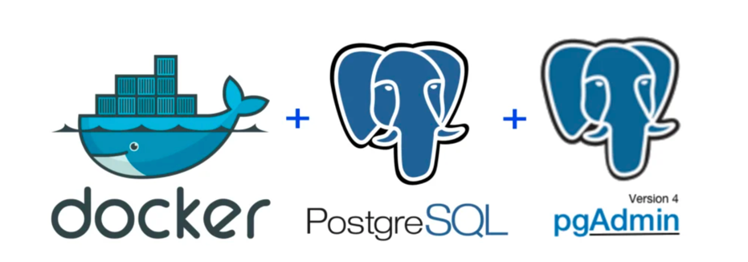
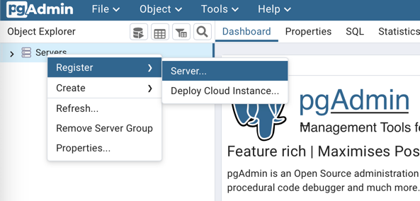
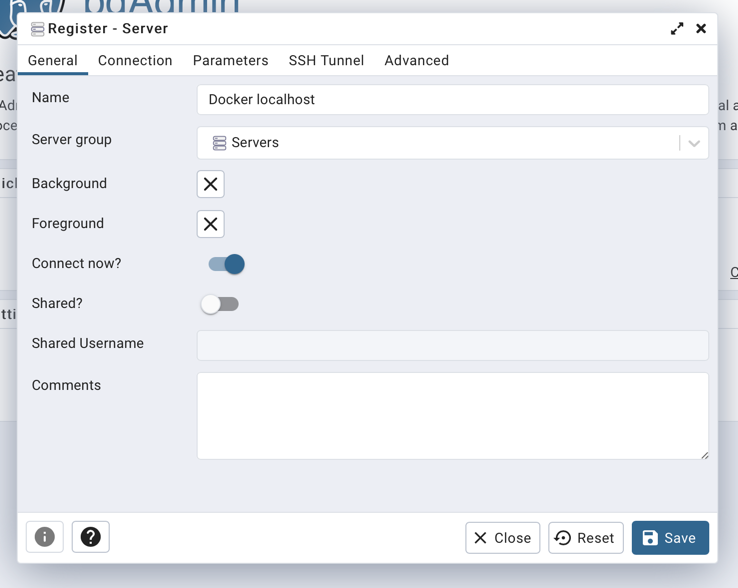
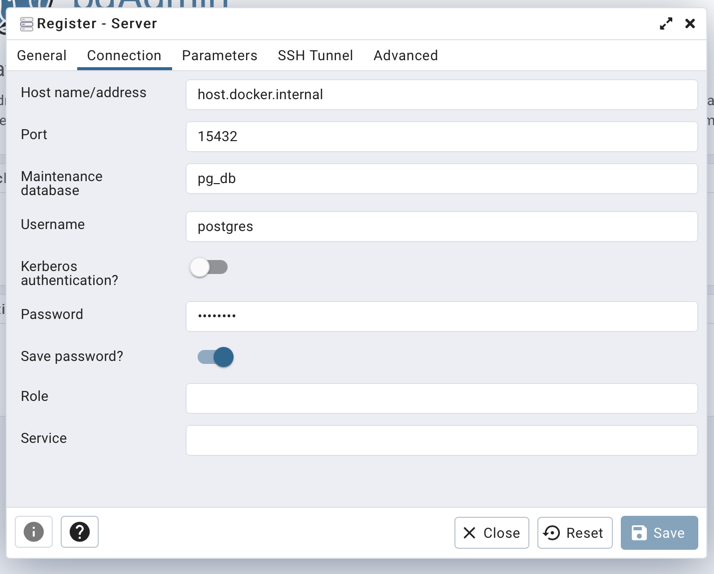
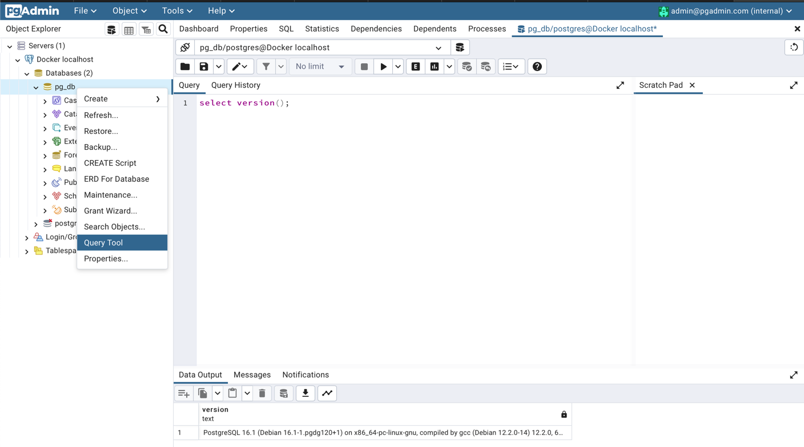

[Вернуться][main]

# Postgres и pgAdmin. Запуск из контейнера



На некоторых системах возникает проблема, с постоянным использованием `sudo` для запуска Docker, для решения предлагаю использовать следующий [гайд](https://github.com/sindresorhus/guides/blob/main/docker-without-sudo.md).
Важно не забыть перелогиниться, как сказано в пункте 2 гайда.

## Запуск контейнеров
Для запуска будем использовать [compose-файл](../../docker/docker-compose.yml).

> 📝 **Для пользователей Windows!** 
>
> Необходимо в compose-файле заменить 6-ю строку на следующую: \
```container_name: "postgres-db"```
> 
> При этом крайне важно сохранить оригинальные отступы. \
> Далее по тексту использовать `postgres-db` вместо `postgres_db`. \
> По `postgres_db` будет выдавать ошибки связанные со стандартами IPv4 и IPv6.

Из директории, в которой находится `docker-compose.yml` запускаем контейнер командой:
```bash
docker-compose up -d
```

Для подключения к БД можно использовать как минимум 3 различных варианта подключения, ниже подробнее о таких способах, для работы можно использовать любой наиболее подходящий вам по духу, будь то командная строка, веб-интерфейс или IDE.

## Подключение к БД

### Подключение к БД из pgAdmin

 * В контейнере `pgadmin` используется 2 переменные среды для входа: адрес электронной почты и пароль. 
 * pgAdmin — это веб-приложение, и его порт по умолчанию — 80; мы сопоставляем его с портом 15433 на нашем локальном хосте, чтобы избежать возможных конфликтов.

email: `admin@admin.com` \
password: `password`

Необходимо открыть pgAdmin, перейдя на `localhost:15433` в браузере. Используйте для входа тот же адрес электронной почты и пароль, которые указали в `.env`-файле.


Щелкните правой кнопкой мыши `Servers` на левой боковой панели и выберите `Register` > `Server`...



В разделе `General` укажите имя сервера - `Docker localhost`.



В разделе `Connection` добавьте следующие значения: \
Host name/address (имя контейнера): `host.docker.internal` \
Port: `15432` \
Maintenance database: `pg_db` \
User: `postgres` \
Password: `postgres`



Нажмите Сохранить. 

Теперь у нас есть полнофункциональный графический менеджер SQL, который мы можем использовать для задач администрирования базы данных и выполнения запросов.



### Подключение к БД из PyCharm или DataGrip или DBeaver

 * В контейнере `postgres_db` используется 4 переменные среды для подключения к БД. 
 * ВАЖНО: эти значения для обучающих примеров, и их никогда не следует использовать в рабочей среде. Измените их соответствующим образом, когда это необходимо.

Для подключения из IDE  можно использовать:

Host: `localhost` \
Port: `15432` \
Database: `pg_db` \
User: `postgres` \
Password: `postgres`

### Подключение к БД из cli

Для подключения из cli необходимо войти в запущенный контейнер с помощью команды: 
```bash
docker exec -ti postgres_db psql -d pg_db -U postgres
```

`-ti` - имя контейнера. \
`-U` - имя пользователя. \
`-d` - имя БД.

После чего можем вводить SQL-запросы, например команда:
```postgresql
select version();
```
Вернёт информацию об используемой версии PostgreSQL

А команда:
```postgresql
select * from pg_catalog.pg_tables;
```
Отобразит список всех таблиц, имеющихся в БД.

Для выхода используйте команду:
```postgresql
exit;
```


[Вернуться][main]

---

[main]: ../../README.md "содержание"
