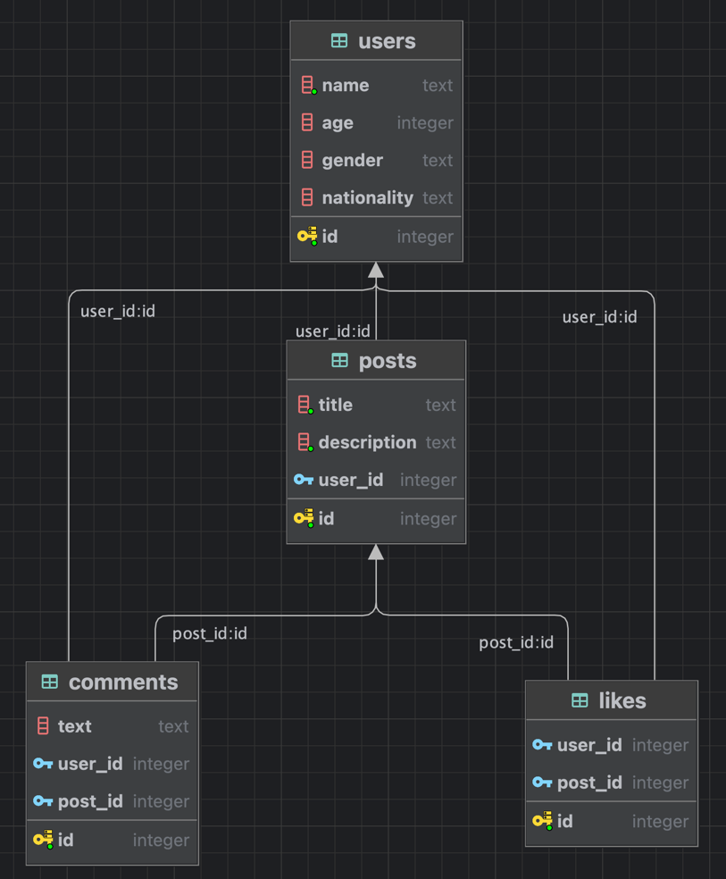

[Вернуться][main]

# Понимание схемы базы данных

На семинаре разработаем небольшую базу данных для приложения, предназначенного для работы с социальными сетями.
База данных будет состоять из четырех таблиц:

1. users
2. posts
3. comments
4. likes

Ниже приведена высокоуровневая схема БД:

[Вернуться][main]

Отношения между `users` и `posts` будут иметь вид "один ко многим", поскольку одному пользователю может
нравиться множество сообщений. Аналогично, один пользователь может оставлять множество комментариев, а одно сообщение
может содержать множество комментариев. Таким образом, `users` и `posts` также будут иметь отношения "один ко многим" с
таблицей `comments`. Это также относится и к таблице `likes`, поэтому и пользователи, и сообщения будут иметь
отношения "один-ко-многим" с таблицей `likes`.

---

[main]: ../../README.md "содержание"
