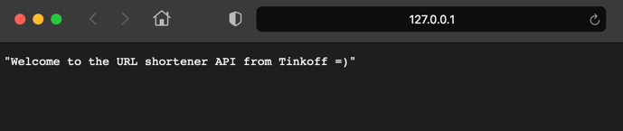
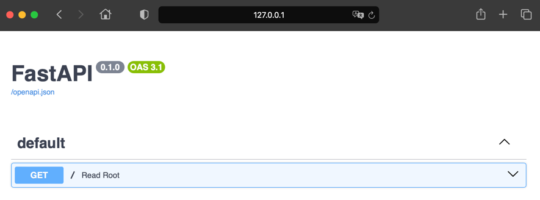
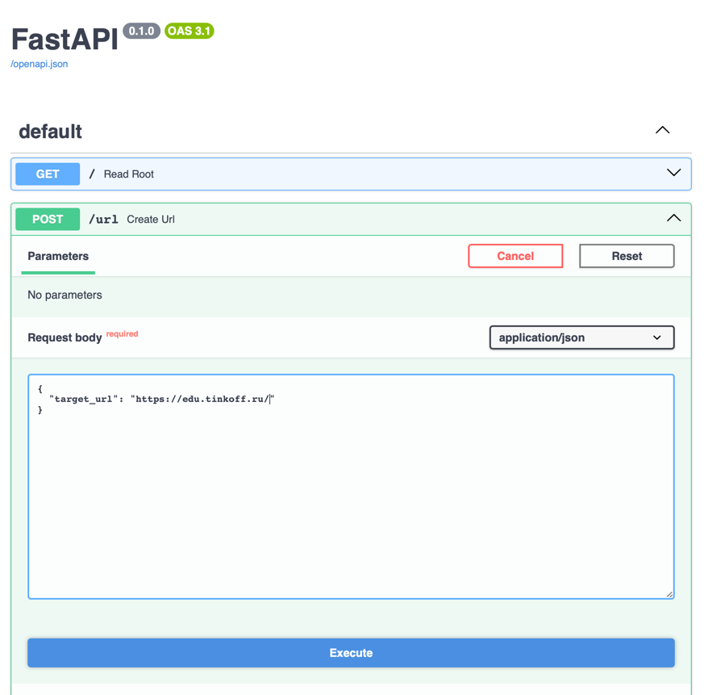
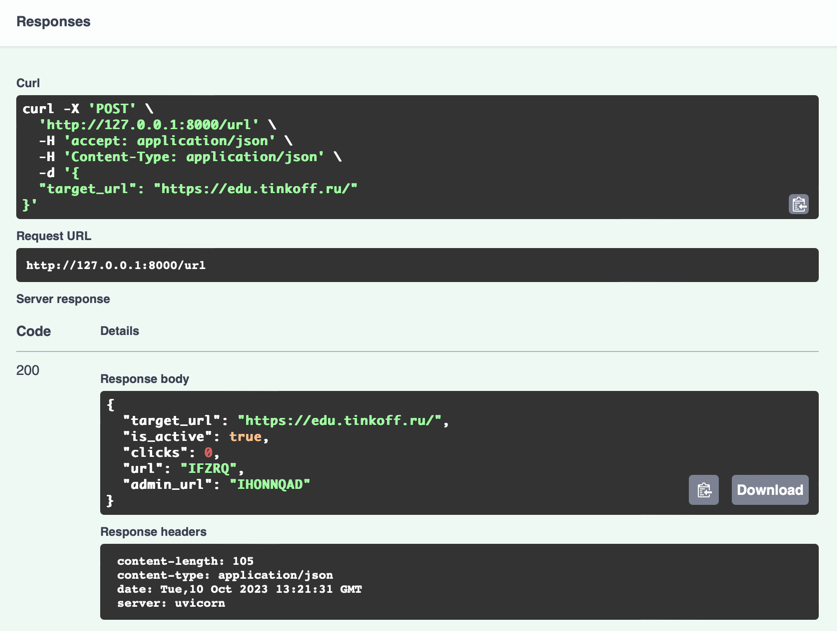

[Вернуться][main]

# Сокращение URL-адресов на Python

Теперь, когда вы подготовили среду разработки, пришло время создать приложение для укорачивания URL. С помощью всего
нескольких строк кода вы создадите приложение `FastAPI` с первым API `endpoint`.

Как только приложение будет запущено, вы определите, что должно делать ваше приложение. Вы смоделируете схему данных в
базе данных. В конце этого блока вы сможете сократить URL-адрес и увидеть, как ваше приложение пересылает URL-адрес
целевой точке.
---

## Создание приложения `FastAPI`

Начнём с реализации `FastAPI` `Hello, World!`. Эта реализация представляет собой приложение `FastAPI`, имеющее один
`endpoint`. Создайте файл с именем `main.py` в папке `shortener_app/` и добавьте в него этот код:

```python linenums="1"
# shortener_app/main.py

from fastapi import FastAPI

app = FastAPI()


@app.get("/")
def read_root():
    return "Welcome to the URL shortener API :)"
```

В строке 3 выполняется импорт `FastAPI`. В строке 5 вы определяете `app`, инстанцируя класс `FastAPI`. Переменная `app`
является
основной точкой взаимодействия при создании `API`. Вы будете неоднократно ссылаться на неё в ходе семинара.

В строке 7 вы используете декоратор операции `path`, чтобы связать корневой путь с `read_root()`, зарегистрировав его в
`FastAPI`. Теперь `FastAPI` прослушивает корневой путь и делегирует все входящие `GET`-запросы функции `read_root()`.

Наконец, в строке 9 вы возвращаете строку. Эта строка отображается при отправке запроса к корневому пути вашего `API`.

Код, который вы только что добавили в `main.py`, является началом работы вашего приложения. Для работы приложения
необходим сервер. Как вы узнали выше, вы уже установили `uvicorn` в качестве сервера.

Запустите сервер с помощью `uvicorn`:

```bash
uvicorn shortener_app.main:app --reload
```

```bash
INFO:     Will watch for changes in these directories: ['/Users/d.kosarevskiy/PycharmProjects/python-hw-5-template']
INFO:     Uvicorn running on http://127.0.0.1:8000 (Press CTRL+C to quit)
INFO:     Started reloader process [87807] using StatReload
INFO:     Started server process [87821]
INFO:     Waiting for application startup.
INFO:     Application startup complete.
```

Приведенной выше командой вы указываете `uvicorn` запустить приложение из файла `main.py` вашего пакета `shortener_app`.
Флаг `--reload` обеспечивает автоматическую перезагрузку сервера при сохранении кода приложения.
Автоматическая перезагрузка будет очень удобна, так как вам не придется постоянно останавливать и перезапускать сервер
во время работы над кодом. Вместо этого можно держать это окно терминала открытым в фоновом режиме.

Теперь, когда сервер запущен, проверьте ответ конечной точки API.
Откройте http://127.0.0.1:8000 в браузере:



Когда вы переходите на сайт http://127.0.0.1:8000 в браузере, вы посылаете GET-запрос к корню вашего приложения FastAPI.
Ответом будет определенное вами приветственное сообщение. Поздравляем, ваше приложение работает!

Замечательным свойством `FastAPI` является то, что фреймворк автоматически создает документацию по API `endpoints`.
Проверьте это в браузере по адресу http://127.0.0.1:8000/docs:



Это документация [Swagger UI][swagger], которую `FastAPI` создал для вас. `Swagger UI` не только даёт
представление о конечных точках `API`, но и позволяет тестировать `API`.

Также можно ознакомиться с альтернативной документацией по ссылке http://127.0.0.1:8000/redoc.

---

## Определение логики работы приложения

Прежде чем добавлять код в приложение, определимся с конечными точками приложения:

| Endpoint            | Тип Запроса | Тело Запроса   | Действие                                                                          |
|---------------------|-------------|----------------|-----------------------------------------------------------------------------------|
| /                   | `GET`       |                | Возвращает строку `Hello, World!` - `string`                                      |
| /url                | `POST`      | целевой URL    | Показывает созданный `url_key` с дополнительной информацией, включая `secret_key` |
| /{url_key}          | `GET`       |                | Переадресация на целевой URL                                                      |
| /admin/{secret_key} | `GET`       |                | Показывает административную информацию о сокращённом URL                          |
| /admin/{secret_key} | `DELETE`    | секретный ключ | Удаление сокращённого URL                                                         |

Когда пользователь публикует целевой URL, который он хочет сократить, ваше приложение должно отправить сообщение,
подтверждающее, что действие выполнено. Чтобы пользователь мог управлять сокращённым URL, вы отправляете клиенту ответ с
некоторой дополнительной информацией. Вот пример того, как может выглядеть тело ответа:

```json
{
  "target_url": "https://edu.tinkoff.ru/",
  "is_active": true,
  "clicks": 0,
  "url": "JNPGB",
  "admin_url": "MIZJZYVA"
}
```

В схеме указано, что API ожидает увидеть в теле запроса и что клиент может ожидать в теле ответа. Для проверки
соответствия запроса и ответа определенным типам данных будет реализована подсказка типов.

Начнём с создания базовых моделей для тел запросов и ответов API в файле `schemas.py`:

```python linenums="1"
# shortener_app/schemas.py

from pydantic import BaseModel


class URLBase(BaseModel):
    target_url: str


class URL(URLBase):
    is_active: bool
    clicks: int

    class Config:
        orm_mode = True


class URLInfo(URL):
    url: str
    admin_url: str
```

В файле `schemas.py` для определения класса `URLBase` используется `BaseModel` от `pydantic`.
Класс `URLBase` в строке 5 содержит поле `target_url`, для которого требуется строка. `target_url` используется
для хранения `URL`, на который направляется ваш сокращённый `URL`.

Класс `URL` в строке 8 наследует поле `target_url` от класса `URLBase`. В строках 9 и 10 в класс добавляются булево поле
`is_active` и целочисленное поле `clicks`. Поле `is_active` позволяет деактивировать сокращённые URL.
С помощью поля `clicks` впоследствии можно будет подсчитать, сколько раз был посещен сокращённый URL.

Как и в файле `config.py`, в строке 12 вы используете класс `Config` для предоставления конфигураций `pydantic`.
В данном случае вы указываете `pydantic` с помощью `orm_mode = True` работать с моделью базы данных.
ORM расшифровывается как Object-Relational Mapping и обеспечивает удобство взаимодействия с базой данных
на основе объектно-ориентированного подхода.
Далее мы рассмотрим, как работает `ORM` и как класс URL связан с таблицей базы данных `urls`.

В строке 15 определяется `URLInfo`. Он расширяет `URL`, требуя две дополнительные строки, url и `admin_url`.
Можно также добавить две строки `url` и `admin_url` к URL. Но добавив `url` и `admin_url` в подкласс `URLInfo`,
можно использовать данные в `API`, не сохраняя их в базе данных.

Вернитесь к файлу `main.py`, чтобы использовать схему `URLBase` в конечной точке `POST`:

```python linenums="1"
# shortener_app/main.py

import validators
from fastapi import FastAPI, HTTPException

from . import schemas


# ...

def raise_bad_request(message):
    raise HTTPException(status_code=400, detail=message)


# ...

@app.post("/url")
def create_url(url: schemas.URLBase):
    if not validators.url(url.target_url):
        raise_bad_request(message="Your provided URL is not valid")
    return f"TODO: Create database entry for: {url.target_url}"
```

В строках 3-6 импортируется `HTTPException` из `fastapi`, а также валидаторы и только что созданный модуль схем. Функция
`raise_bad_request()` в строке 10 принимает в качестве аргумента сообщение и вызывает `HTTPException`
со статус кодом 400.
В строке 18 она будет вызвана, когда предоставленный URL окажется недействительным. Позже в учебнике вы будете
использовать функцию `raise_bad_request()` повторно, поэтому вынесли HTTPException в отдельную функцию.

В строке 16 определяется конечная точка `create_url`, которая ожидает строку URL в качестве тела POST-запроса.
В строке 15 эта конечная точка определяется как конечная точка `POST`-запроса с помощью декоратора `@app.post`.
URL для конечной точки `create_url` имеет вид `/url`.

Хотя `pydantic` и проверяет, что URL является строкой, он не проверяет, является ли эта строка действительным URL. Этим
занимается пакет `validators`, который вы установили ранее. В строке 17 проверяется, является ли
`url.target_url` корректным URL. Если предоставленный `target_url` не является корректным, то вызывается функция
`raise_bad_request()`. Пока что в строке 19 вы возвращаете сообщение только самому себе.
Позже вы создадите запись в базе данных, если `target_url` окажется действительным.

Теперь в `main.py` есть функции, работающие со схемой, которую вы определили в `schemas.py`.
Вы можете посылать запросы к конечным точкам API и получать ответы, но под капотом пока ничего не происходит.
В следующем разделе вы вдохнёте жизнь в свой проект, связав приложение с базой данных.

---

## Подготовка базы данных

Вы уже можете обратиться к конечной точке API для сокращения URL, но на стороне бэкенда пока ничего не происходит.
В этом разделе вы создадите и подключите базу данных к вашей кодовой базе.

Сначала сохраните код, необходимый для подключения к базе данных, в файле с именем `database.py`:

```python linenums="1"
# shortener_app/database.py

from sqlalchemy import create_engine
from sqlalchemy.ext.declarative import declarative_base
from sqlalchemy.orm import sessionmaker

from .config import get_settings

engine = create_engine(
    get_settings().db_url, connect_args={"check_same_thread": False}
)
SessionLocal = sessionmaker(
    autocommit=False, autoflush=False, bind=engine
)
Base = declarative_base()
```

Ранее вы узнали, что для взаимодействия с базой данных будет использоваться `SQLAlchemy`.
В частности, для определения движка в строке 9 будет использована функция `create_engine()`,
которая импортируется в строке 3. Можно считать, что движок - это точка входа в базу данных.
Первым аргументом является URL базы данных, который вы получаете из `db_url` настроек, импортированных в строке 7.

Значение `check_same_thread` равно `False`, поскольку вы работаете с базой данных `SQLite`. С помощью этого аргумента
соединения `SQLite` позволяет взаимодействовать с базой данных более чем одному запросу за раз.

Для создания класса `SessionLocal` в строке 12 используется `sessionmaker`, который импортируется в строке 5.
Сессия (рабочий сеанс) для работы с базой данных будет создан позже при инстанцировании `SessionLocal`.

Функция `declarative_base`, импортируемая в строке 4, возвращает класс, который соединяет механизм базы данных с
функциональностью `SQLAlchemy` в моделях. В строке 15 вы присваиваете `declarative_base()` классу `Base`.
`Base` будет классом, от которого наследуется модель базы данных в вашем файле `models.py`.

В то время как файл `database.py` содержит информацию о подключении к базе данных, файл `models.py` будет описывать
содержимое вашей базы данных. Чтобы продолжить, создайте файл `models.py`:

```python linenums="1"
# shortener_app/models.py

from sqlalchemy import Boolean, Column, Integer, String

from .database import Base


class URL(Base):
    __tablename__ = "urls"

    id = Column(Integer, primary_key=True)
    key = Column(String, unique=True, index=True)
    secret_key = Column(String, unique=True, index=True)
    target_url = Column(String, index=True)
    is_active = Column(Boolean, default=True)
    clicks = Column(Integer, default=0)
```

Код, который вы добавляете в `models.py`, похож на код, который вы написали в `schemas.py`. В `schemas.py` вы
определили,
какие данные ваш `API` ожидает от клиента и сервера. В `models.py` вы объявляете, как ваши данные должны храниться в
базе
данных.

В строке 7 вы создаете модель базы данных с именем URL. Модель URL является подклассом `Base`, который вы импортируете в
строке 5.

Обычно принято давать модели единственное имя, а таблицам базы данных - множественные имена. Поэтому в строке 7 модель
названа URL, а в строке 8 задана специальная переменная `__tablename__`.

В строке 10 вы определяете `id` в качестве первичного ключа вашей базы данных. Задавая аргумент `primary_key`
равным `True`,
вы избавляетесь от необходимости указывать уникальный аргумент, поскольку по умолчанию для первичных ключей он все равно
равен `True`.

Столбцы `key` и `secret_key`, определенные в строках 11 и 12, также будут содержать уникальные записи. Поле `key` будет
содержать случайную строку, которая станет частью сокращенного URL. С помощью `secret_key` можно предоставить
пользователю
секретный ключ для управления его сокращенным URL и просмотра статистики.

В строке 13 задается столбец `target_url` для хранения строк URL, для которых ваше приложение предоставляет сокращенные
URL. Важно, чтобы для столбца `target_url` не было задано значение `unique=True`. Если бы вы принимали только уникальные
значения для этого поля базы данных, то не позволили бы разным пользователям пересылать на один и тот же URL.

Ожидаемое поведение вашего приложения заключается в том, что любой пользователь может создать сокращенный URL для любого
целевого URL, не зная, существует ли уже такая переадресация. Поэтому, несмотря на то, что вы будете предоставлять
уникальный сокращенный URL, несколько сокращенных URL могут перенаправлять на один и тот же сайт.

Как будет показано далее, булевский столбец `is_active` в строке 14 пригодится, когда пользователь захочет удалить
сокращенный URL. Вместо того чтобы давать пользователю возможность удалять запись в базе данных напрямую, вы сделаете ее
неактивной. Таким образом, вы подстраховываетесь на случай критических действий и можете отменить удаление, если оно
было произведено пользователем случайно.

В строке 15 задается столбец `clicks`, который начинается с нуля. В дальнейшем это поле будет увеличивать целое число
каждый раз, когда кто-то будет щелкать по укороченной ссылке.

---

## Подключение базы данных

Теперь, когда модель базы данных создана, можно связать свое приложение с базой данных. Пока что большую часть кода для
взаимодействия с базой данных вы добавите в файл `main.py`:

```python linenums="1"
# shortener_app/main.py

import secrets

import validators
from fastapi import Depends, FastAPI, HTTPException
from sqlalchemy.orm import Session

from . import models, schemas
from .database import SessionLocal, engine

app = FastAPI()
models.Base.metadata.create_all(bind=engine)


def get_db():
    db = SessionLocal()
    try:
        yield db
    finally:
        db.close()


# ...

@app.post("/url", response_model=schemas.URLInfo)
def create_url(url: schemas.URLBase, db: Session = Depends(get_db)):
    if not validators.url(url.target_url):
        raise_bad_request(message="Your provided URL is not valid")

    chars = "ABCDEFGHIJKLMNOPQRSTUVWXYZ"
    key = "".join(secrets.choice(chars) for _ in range(5))
    secret_key = "".join(secrets.choice(chars) for _ in range(8))
    db_url = models.URL(
        target_url=url.target_url, key=key, secret_key=secret_key
    )
    db.add(db_url)
    db.commit()
    db.refresh(db_url)
    db_url.url = key
    db_url.admin_url = secret_key

    return db_url
```

В файле `main.py` произошло много изменений. Построчно:

- Строки 3-7 импортируют функции и классы из внешних модулей.
- Строка 9 импортирует модели и схемы ваших внутренних модулей.
- Строка 10 импортирует `SessionLocal` и `engine` из вашего модуля базы данных.
- Строка 12 остается неизменной. Здесь вы определяете свое приложение `FastAPI`.
- Строка 13 связывает ваш движок базы данных с `models.Base.metadata.create_all()`. Если база данных, которую вы
  определили в движке, еще не существует, то она будет создана со всеми смоделированными таблицами при первом запуске
  приложения.
- В строках 15-20 определяется функция `get_db()`, которая при каждом запросе будет создавать и выдавать новые сессии
  базы данных. По завершении запроса сеанс закрывается функцией `db.close()`. Блок `try ... finally` используется для
  закрытия соединения с базой данных в любом случае, даже при возникновении ошибки во время запроса.
- Строка 24 - это декоратор операции `path`, который гарантирует, что функция `create_url()`, расположенная ниже,
  ответит на все `POST`-запросы по пути `/url`.
- В строке 25 определяется функция `create_url()`, которая требует в качестве аргумента схему `URLBase` и зависит от
  сессии базы данных. Передавая `get_db` в `Depends()`, вы устанавливаете сессию базы данных для запроса и закрываете
  ее по завершении запроса.
- В строках 26 и 27 проверяется, что предоставленные данные `target_url` являются корректным URL. Если URL не является
  корректным, то вызывается функция `raise_bad_request()`.
- В строках 29-31 задаются случайные строки для ключа `key` и `secret_key`.
- В строках 32-37 создается запись в базе данных для `target_url`.
- Строки 38 и 39 добавляют в `db_url` ключи `key` и `secret_key`, чтобы они соответствовали требуемой схеме `URLInfo`,
  которую необходимо вернуть в конце функции.

Вам может показаться, что только что добавленный код выходит за рамки функции `create_url()`. Ваша интуиция верна.
Действительно, можно найти более подходящие места для создания произвольных строк и выполнения действий с базой данных.
Но можно и не быть идеальным сразу. Прежде чем устранять недостатки, проверьте, работает ли ваше приложение так, как
ожидалось.

Перезапустите свой живой сервер, если он еще не перезапустился сам:

```bash
uvicorn shortener_app.main:app --reload
```

При перезагрузке сервера `sqlalchemy` автоматически создал вашу базу данных в том месте, которое вы указали в переменной
окружения DB_URL. Если в качестве значения DB_URL вы использовали `sqlite:///./shortener.db`, то в корневом каталоге
вашего проекта теперь должен быть файл с именем `shortener.db`. Это и есть ваша база данных `SQLite`.

Пока база содержит таблицу, которую вы определили в `models.py`, но не содержит никаких данных. Чтобы посмотреть на нее,
запустите интерпретатор Python и выполните команды, показанные ниже:

```python linenums="1"
from shortener_app.database import SessionLocal

db = SessionLocal()

from shortener_app.models import URL

db.query(URL).all()
```

```
[]
```

Сначала в строке 1 импортируется SessionLocal, а в строке 3 инстанцируется соединение с базой данных. В строке 5
импортируется модель URL. В строке 6 в качестве аргумента запроса к базе данных используется URL, чтобы запросить все
записи базы данных для URL. Возвращаемый список в строке 7 пуст, поскольку таблица urls еще не содержит никаких данных.

Оставим пока этот сеанс открытым и перейдем в браузер. Откройте http://127.0.0.1:8000/docs и используйте конечную точку
POST для создания коротких URL:





Это работает, поскольку ваш API отвечает данными, которые вы определили в файле `schemas.py`:

```json
{
  "target_url": "https://edu.tinkoff.ru/",
  "is_active": true,
  "clicks": 0,
  "url": "IFZRQ",
  "admin_url": "IHONNQAD"
}
```

После использования конечной точки POST вашего приложения убедитесь, что запрос создал соответствующие записи в базе
данных:

```python linenums="1"
db.query(URL).all()
```

```
[<shortener_app.models.URL object at 0x1128bb490>]
```

С помощью `db.query(URL).all()` вы запрашиваете все записи таблицы URL. В ответ вы получаете список всех записей базы
данных, созданных с помощью POST-запросов, которые вы отправляли своему API.

Теперь вы можете хранить данные в своей базе данных, причем они сохраняются в течение нескольких сеансов работы
пользователей. Это значительная веха для вашего приложения!

Вы, как бэкенд-разработчик, можете быть довольны. Но чтобы пользователи были довольны, необходимо добавить такую важную
функцию, как реальная переадресация на целевой URL. В следующем разделе вы улучшите свое приложение для пересылки
сокращенного URL на целевой URL.

---

## Передача сокращённого URL-адреса

Приложение предназначено для создания сокращенных URL-адресов, которые ведут на целевой URL-адрес. Например, если вы
хотите поделиться фотографией, то вам не придется использовать неудобную длинную ссылку. Вместо этого можно использовать
наше приложение для создания короткой ссылки.

Это означает, что в вашем приложении должен быть маршрут, переадресующий на целевой URL. В более техническом смысле
поведение переадресации означает, что необходимо перенаправлять HTTP-запросы с `URL.key` на адрес `URL.target_url`.

Обновим файл `main.py`, чтобы реализовать `RedirectResponse`:

```python linenums="1"
# shortener_app/main.py

# ...

from fastapi import Depends, FastAPI, HTTPException, Request
from fastapi.responses import RedirectResponse


# ...

def raise_not_found(request):
    message = f"URL '{request.url}' doesn't exist"
    raise HTTPException(status_code=404, detail=message)


# ...

@app.get("/{url_key}")
def forward_to_target_url(
        url_key: str,
        request: Request,
        db: Session = Depends(get_db)
):
    db_url = (
        db.query(models.URL)
        .filter(models.URL.key == url_key, models.URL.is_active)
        .first()
    )
    if db_url:
        return RedirectResponse(db_url.target_url)
    else:
        raise_not_found(request)
```

Для обеспечения необходимого поведения перенаправления в приложении используются классы `Request` и `RedirectResponse`,
которые импортируются в строках 5 и 6. `RedirectResponse` возвращает HTTP-переадресацию, перенаправляющую запрос
клиента.

Помните функцию `raise_bad_request()`, которую вы создали ранее? В строке 10 вы добавляете аналогичную функцию с именем
`raise_not_found()`. Вы будете использовать `raise_not_found()` в строке 30, если предоставленный URL.key не
соответствует
ни одному URL в вашей базе данных. В отличие от `raise_bad_request()`, где передается сообщение, `raise_not_found()`
всегда
возвращает то же самое сообщение, которое вы определили в строке 11. Канонически в `HTTPException` возвращается код
состояния HTTP 404.

В строке 17 создается функция `forward_to_target_url()` с помощью функции-декоратора `@app.get()` из строки 16. При
использовании декоратора `@app.get()` разрешаются GET-запросы к URL-адресу, указанному в качестве аргумента. С
аргументом `/{url_key}` функция `forward_to_target_url()` будет вызываться каждый раз, когда клиент запросит URL,
соответствующий шаблону `host` и `key`.

В строках 22-26 выполняется поиск активной записи URL с указанным ключом `url_key` в базе данных. Если такая запись
найдена, то в строке 28 возвращается `RedirectResponse` с `target_url`. Если подходящая запись в базе данных не найдена,
то выдается сообщение об ошибке `HTTPException`.

В браузере опробуйте только что реализованное поведение:

Сначала зайдите в документацию по адресу http://127.0.0.1:8000/docs и создайте POST-запрос к конечной точке `create_url`.
В качестве целевого URL вы используете, например https://edu.tinkoff.ru/. Скопируйте ключ, полученный в ответе, и попробуйте
выполнить переадресацию. В приведенном примере http://127.0.0.1:8000/IFZRQ успешно пересылается
на https://edu.tinkoff.ru/.

Это почти идеально! Почему только почти? Хотя код работает, и `create_url()`, и `forward_to_target_url()` имеют свои
недостатки. В следующем разделе вы очистите свой код, прежде чем создавать дополнительные функции и конечные точки для
вашего приложения.

[Вернуться][main]

---

[main]: ../../README.md "содержание"

[swagger]: https://swagger.io/tools/swagger-ui/ "swagger"
